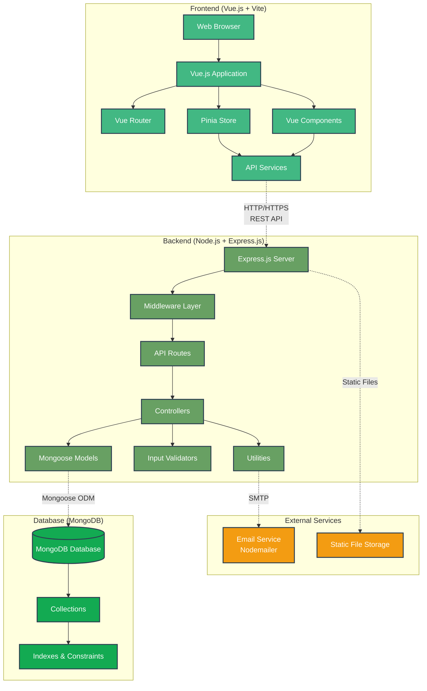
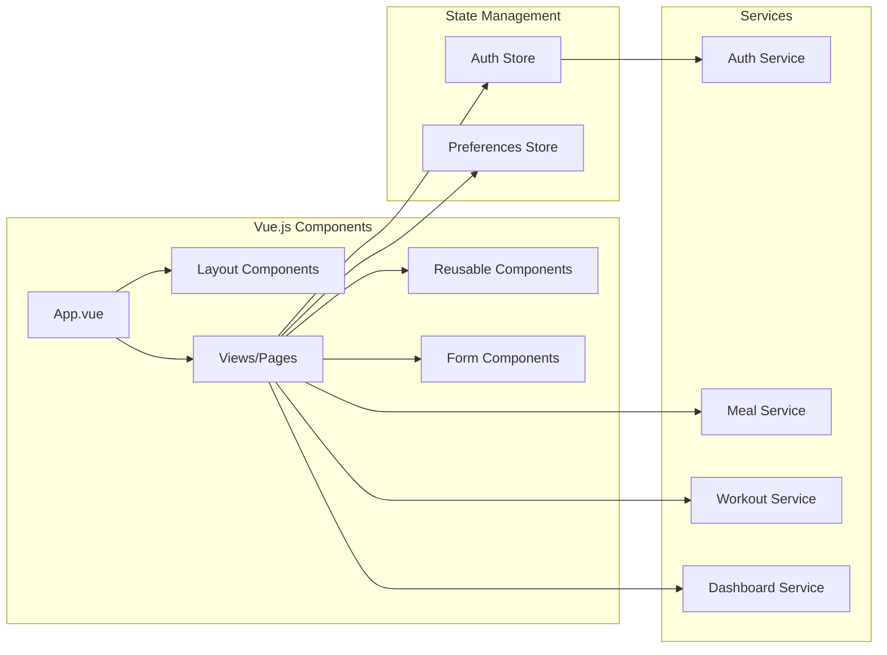
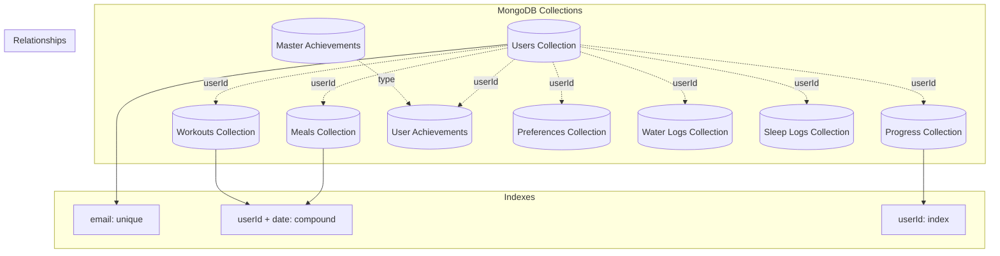
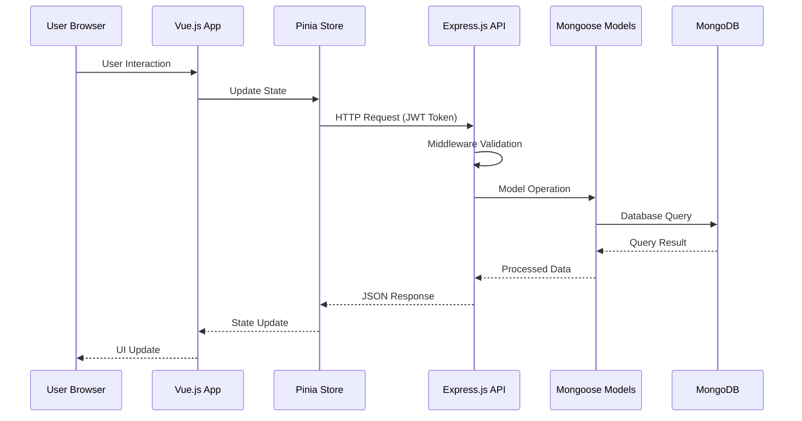
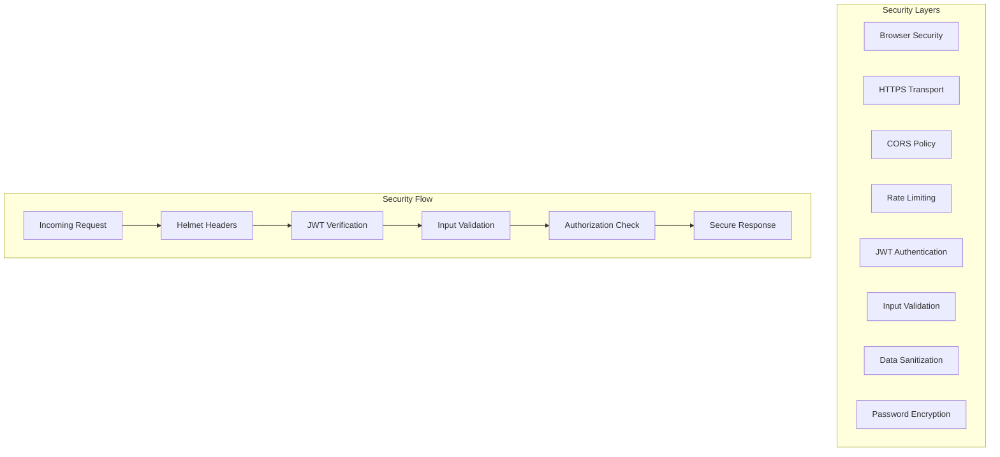

# Thryve Application Architecture Diagram

## MEVN Stack Architecture (MongoDB, Express.js, Vue.js, Node.js)



## Detailed Component Breakdown

### Frontend Layer (Vue.js)


### Backend Layer (Express.js)
```mermaid
graph TB
    subgraph "Express.js Application"
        Server[server.js]
        App[app.js]
        Config[Configuration]
        
        Server --> App
        Server --> Config
    end

    subgraph "Middleware Stack"
        Helmet[Helmet - Security]
        CORS[CORS - Cross-Origin]
        Auth[Auth Middleware]
        RateLimit[Rate Limiting]
        ErrorHandler[Error Handler]
        
        App --> Helmet
        Helmet --> CORS
        CORS --> RateLimit
        RateLimit --> Auth
        Auth --> ErrorHandler
    end

    subgraph "API Routes"
        AuthRoutes[/api/auth]
        UserRoutes[/api/users]
        WorkoutRoutes[/api/workouts]
        MealRoutes[/api/meals]
        DashboardRoutes[/api/dashboard]
        AchievementRoutes[/api/achievements]
        
        App --> AuthRoutes
        App --> UserRoutes
        App --> WorkoutRoutes
        App --> MealRoutes
        App --> DashboardRoutes
        App --> AchievementRoutes
    end

    subgraph "Controllers"
        AuthController[Auth Controller]
        UserController[User Controller]
        WorkoutController[Workout Controller]
        MealController[Meal Controller]
        DashboardController[Dashboard Controller]
        
        AuthRoutes --> AuthController
        UserRoutes --> UserController
        WorkoutRoutes --> WorkoutController
        MealRoutes --> MealController
        DashboardRoutes --> DashboardController
    end
```

### Database Layer (MongoDB)


## Data Flow Architecture



## Security Architecture



## Technology Stack Details

| Layer | Technology | Purpose |
|-------|------------|---------|
| **Frontend** | Vue.js 3 | Component-based UI framework |
| | Vue Router | Client-side routing |
| | Pinia | State management |
| | Vite | Build tool and dev server |
| | Axios | HTTP client |
| | PrimeVue | UI component library |
| **Backend** | Node.js | JavaScript runtime |
| | Express.js | Web application framework |
| | Mongoose | MongoDB object modeling |
| | JWT | Authentication tokens |
| | Bcrypt | Password hashing |
| | Helmet | Security headers |
| | Joi | Input validation |
| **Database** | MongoDB | NoSQL document database |
| | MongoDB Indexes | Query optimization |
| **External** | Nodemailer | Email service |
| | Static Files | Asset serving |

## Key Features by Layer

### Frontend Features
- 🔐 User Authentication & Registration
- 📊 Dashboard Analytics
- 🏋️ Workout Tracking
- 🍽️ Meal Logging
- 💧 Water Intake Monitoring
- 😴 Sleep Tracking
- 🏆 Achievement System
- 👤 Profile Management

### Backend Features
- 🛡️ JWT Authentication
- 📝 Input Validation
- 🔒 Password Security
- 📧 Email Services
- 🚦 Rate Limiting
- 📊 Data Aggregation
- 🏆 Achievement Logic
- 📈 Progress Tracking

### Database Features
- 👥 User Management
- 📊 Health Data Storage
- 🔗 Relational Data Structure
- 📈 Performance Indexes
- 🔄 Data Integrity
- 📅 Time-series Data